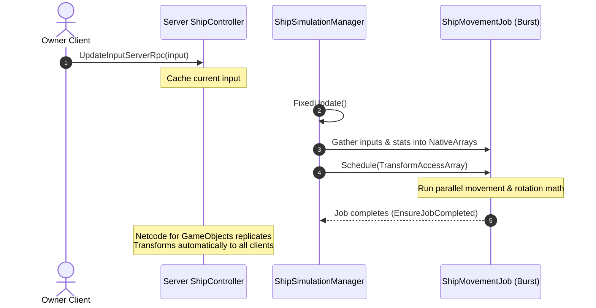

# Space Combat Movement System: Netcode for GameObjects + C# Job System

This document details the architectural design for the 6-DOF ship movement system.

---

## 1. Architectural Overview

To combine the networking model of **Netcode for GameObjects (NGO)** with the performance of **C# Job System + Burst**, we use a hybrid architecture:

* **Netcode for GameObjects (NGO)** is used for network management, connection bootstrapping, client ownership replication, and input synchronization (via Server RPCs).
* **C# Job System & Burst Compiler** are used for the actual movement simulation math. The server gathers inputs and executes the movement updates in parallel across worker threads, bypassing main-thread overhead.



---

## 2. Key Components

### 2.1 Data Structures
We use memory-copyable struct models to pass player input and ship specifications into the native job container:

* **`ShipInput`**: Represents the current 6-DOF inputs of the pilot (Pitch, Yaw, Roll, and Thrust).
* **`ShipStats`**: Contains the speed and turn rate parameters for movement calculations.

```csharp
public struct ShipInput : INetworkSerializeByMemcpy
{
    public float Pitch;
    public float Yaw;
    public float Roll;
    public float Thrust;
}

public struct ShipStats : INetworkSerializeByMemcpy
{
    public float MoveSpeed;
    public float TurnSpeed;
}
```

### 2.2 ShipController
A `NetworkBehaviour` that runs on each ship instance:
* If the local client is the **Owner**, it reads physical inputs and forwards them to the server via `UpdateInputServerRpc`.
* When spawned, it automatically registers itself with the `ShipSimulationManager`.

### 2.3 ShipSimulationManager
A server-side singleton that orchestrates the simulation:
* Maintains a list of active ships and builds/disposes native memory containers (`NativeArray<ShipInput>`, `NativeArray<ShipStats>`, and `TransformAccessArray`).
* In `FixedUpdate`, schedules `ShipMovementJob` using `IJobParallelForTransform`.

### 2.4 ShipMovementJob
A Burst-compiled job that performs the 6-DOF movement calculations in parallel:
* Calculates pitch, yaw, and roll rotations using `Quaternion.AngleAxis` and applies them to `transform.rotation`.
* Translates `transform.position` along the ship's local forward vector based on thrust and speed.

---

## 3. Performance & Optimization

* **Zero Garbage Collection (GC) in Hot Paths:** NativeArrays are allocated persistently and only rebuilt when ships are registered or unregistered.
* **Burst Compilation:** The movement job is decorated with `[BurstCompile]` to generate optimized machine code for fast trigonometric and vector math.
* **Multithreading:** Transform updates are handled on Unity worker threads via `IJobParallelForTransform`.
