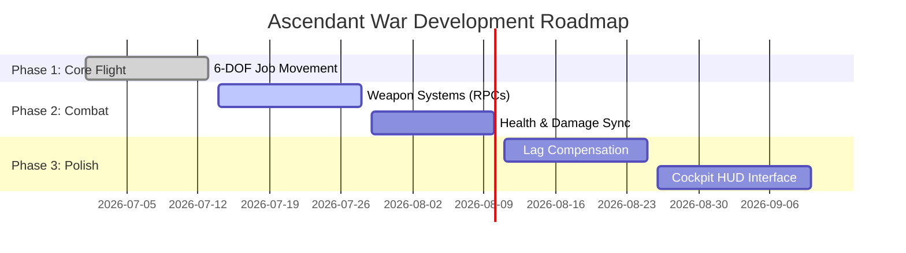

# Game Design Document: Ascendant War

**Ascendant War** is a high-performance, multiplayer 6-DOF (Six Degrees of Freedom) space combat simulator built in Unity.

---

## 1. Executive Summary

* **Genre:** Multiplayer Space Combat / Flight Simulator
* **Camera Perspective:** 3D First-Person (Cockpit) / Third-Person (Chase)
* **Core Loop:** High-speed dogfighting, resource management, and tactical positioning.
* **Technology Stack:**
  - **Engine:** Unity 6000.4
  - **Networking:** Unity Netcode for GameObjects (NGO)
  - **Physics/Simulation:** C# Job System + Burst Compiler (Authoritative Server)

---

## 2. Core Gameplay Mechanics

### 2.1 6-DOF Flight Model
Players control a starship with six degrees of freedom, allowing translation and rotation along all three axes:
* **Pitch (X-Axis Rotation):** Nose up/down (W/S keys).
* **Yaw (Y-Axis Rotation):** Nose left/right (A/D keys).
* **Roll (Z-Axis Rotation):** Banking left/right (Q/E keys).
* **Forward Thrust (Z-Axis Translation):** Accelerating forward (Spacebar).

```
          [Pitch (X)]
               ^
               |  / [Roll (Z)]
               | /
               |/
 [Yaw (Y)] <---+---> [Thrust (Forward)]
```

### 2.2 Server-Authoritative Simulation
To ensure cheat-prevention and uniform state:
* Clients read physical keyboard inputs and transmit them to the server via ServerRpc.
* The Server processes movement updates for all ships inside a unified `FixedUpdate` physics tick.
* Results (Position/Rotation) are automatically synchronized back to all clients.

---

## 3. Technical Architecture

```mermaid
graph TD
    subgraph Clients (Players)
        C1[Client 1: ShipController]
        C2[Client 2: ShipController]
    end

    subgraph Server (Authoritative)
        SR[NetworkManager]
        SM[ShipSimulationManager]
        JB[ShipMovementJob (Burst)]
    end

    C1 -- 1. Send Input RPC --> SR
    C2 -- 1. Send Input RPC --> SR
    SR -- 2. Collect Inputs --> SM
    SM -- 3. Schedule Job --> JB
    JB -- 4. Update Transforms --> SM
    SM -- 5. Replicate Positions/Rotations --> C1 & C2
```

### 3.1 Network Management
* **`NetworkManager`:** Standard NGO component running `UnityTransport` as the default transport layer.
* **`NetworkBootstrap`:** Provides an in-game HUD interface to run the application as a **Host**, **Dedicated Server**, or **Client**.

### 3.2 Simulation Pipeline
1. **`ShipController`**
   - Monitors player input.
   - If owned by local client, regularly calls `UpdateInputServerRpc` to update the server with the pilot's actions.
2. **`ShipSimulationManager`**
   - Stores active ship registration.
   - Allocates GC-free persistent native containers (`NativeArray<ShipInput>`, `NativeArray<ShipStats>`, `TransformAccessArray`).
   - Runs on the server during `FixedUpdate` to execute the simulation.
3. **`ShipMovementJob`**
   - A Burst-compiled multithreaded job updating all ship transforms in parallel.
   - Calculates 3D rotational Euler rotation and forward velocity translation.

---

## 4. Level & Environment Design

* **Main Scene (`OutdoorsScene`):** The primary dogfight arena consisting of open space, floating debris, and asteroid hazards.
* **Network Infrastructure:** Dedicated GameObjects for environment hazards, spawn points, and boundary volumes.

---

## 5. Roadmap & Future Modules



### 5.1 Weapon Systems
* Spawn projectiles on the server using RPC triggers.
* Raycast laser hits on the server with client-side visual effects.

### 5.2 Health and Damage Replication
* Track durability via server-side variables synced to clients using `NetworkVariable<float>`.
* Trigger death/respawn loops when durability drops below zero.

### 5.3 Client-Side Prediction (CSP)
* Implement local prediction for local player ships to eliminate input latency.
* Correct local positions smoothly when server updates differ from predicted trajectory.
