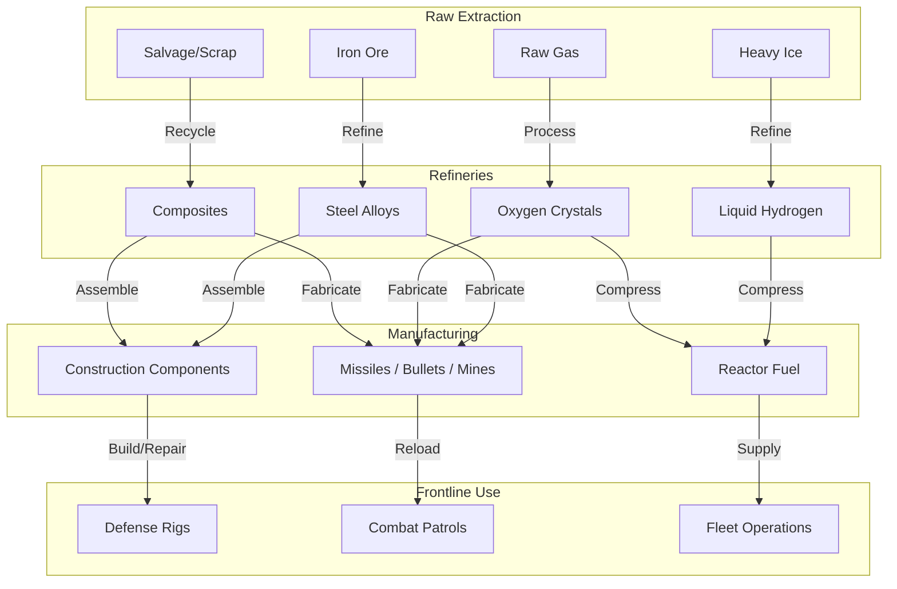

# Economy & Infrastructure Design: Ascendant

This document details the resource hierarchy, logistics pipelines, conversion matrix, and building database that drive the persistent warfare economy in **Ascendant**.

---

## 1. Resource Hierarchy

The economy is divided into three tiers: **Raw Materials** (harvested from space), **Refined Materials** (processed in refineries), and **Manufactured Products** (end-use items for ships, defenses, or faction tech).

```
[ Raw Resources ] ------Refinery-----> [ Refined Materials ] ------Factory-----> [ Manufactured Products ]
- Iron Ore                             - Steel Alloys                           - Kinetic Ammo Crates
- Raw Gas                              - Liquid Hydrogen                        - Missile Pod Crates
- Heavy Ice                            - Oxygen Crystals                        - Proximity Mine Crates
- Salvage/Scrap                        - Composites                             - Construction Components
                                                                                - Tech Parts
```

### 1.1 Tier 1: Raw Materials (Harvested)
* **Iron Ore:** Mined from standard metal-rich asteroids. Heavy and bulky.
* **Raw Gas:** Mined from gaseous nebulae or siphoned from gas giant atmospheres.
* **Heavy Ice:** Extracted from frozen comet fragments. Source of hydrogen fuel and cooling systems.
* **Salvage / Scrap:** Reclaimed from ship wreckage and destroyed space stations.

### 1.2 Tier 2: Refined Materials (Processed)
* **Steel Alloys:** Refined from Iron Ore. The fundamental building block of all structures and hulls.
* **Liquid Hydrogen:** Refined from Heavy Ice/Raw Gas. Used for standard sub-light engines.
* **Oxygen Crystals:** Processed from Raw Gas. Essential for life support and reactor cooling.
* **Composites:** Chemical compounds processed from Salvage/Scrap. Required for high-tech shields, advanced modules, and warp drives.

### 1.3 Tier 3: Manufactured Products (End-Use)
* **Kinetic Ammo Crates:** Crafted using Steel Alloys. Fired by ship autocannons and flak cannons.
* **Missile Pod Crates:** Crafted using Steel Alloys and Oxygen Crystals. Fired by ship rocket launchers and missile defense platforms.
* **Proximity Mine Crates:** Manufactured from Steel Alloys and Composites. Used by ships to lock down warp paths and hyperlanes.
* **Tech Parts:** Rare components salvaged or generated by laboratories. Deposited to unlock faction technologies.
* **Construction Components:** Manufactured from Steel Alloys. Carried by logistics ships to build outposts.

---

## 2. Resource Logistics Pipeline

The flowchart below demonstrates the full conversion pipeline from raw material extraction to frontline military consumption.



### 2.1 Conversion & Efficiency Ratios

| Input Resource | Output Resource | Facility | Conversion Ratio | Cycle Time |
| :--- | :--- | :--- | :--- | :--- |
| 100 Iron Ore | 40 Steel Alloys | Refinery | 2.5 : 1 | 10s |
| 100 Heavy Ice | 50 Liquid Hydrogen | Refinery | 2 : 1 | 8s |
| 100 Raw Gas | 30 Oxygen Crystals | Gas Compressor | 3.3 : 1 | 12s |
| 100 Salvage/Scrap | 50 Composites | Scrap Recycler | 2 : 1 | 8s |
| 70 Steel Alloys | 10 Construction Components | Component Assembler| 7 : 1 | 15s |
| 30 Alloys | 10 Kinetic Ammo Crates | Munitions Factory | 3 : 1 | 8s |
| 40 Alloys + 10 Oxygen | 5 Missile Pod Crates | Munitions Factory | 10 : 1 | 12s |
| 50 Alloys + 20 Composites | 5 Proximity Mine Crates | Munitions Factory | 14 : 1 | 15s |

---

## 3. Infrastructure & Buildings Catalog

All buildings are player-constructed, require upkeep, and are serialized persistently.

### 3.1 Resource Gathering Outposts
* **Asteroid Mining Rig:**
  * **Function:** Extracts raw Iron Ore from nearby asteroids.
  * **Upkeep:** 10 Fuel / hour.
  * **Build Cost:** 200 Construction Components.
  * **Upgrades:**
    * *Tier II Drill:* Increases extraction rate by 50% (Cost: 100 Alloys, 50 Composites).
    * *Core Extractor:* Triggers a low chance to retrieve rare Salvage/Scrap (Cost: 200 Alloys, 100 Composites).
* **Gaseous Fuel Scoop:**
  * **Function:** Orbital scoop placed near Gas Giants or Star Coronas. Siphons Raw Gas.
  * **Upkeep:** 15 Fuel / hour.
  * **Build Cost:** 300 Construction Components.
  * **Upgrades:**
    * *Solar Intake Shielding:* Allows siphoning directly from Star Coronas for +100% yield (Cost: 150 Alloys, 100 Composites).

### 3.2 Processing & Assembly Plants
* **Industrial Refinery:**
  * **Function:** Refines raw Iron Ore, Heavy Ice, and Salvage into Alloys, Hydrogen, and Composites.
  * **Upkeep:** 30 Fuel / hour.
  * **Build Cost:** 400 Construction Components.
  * **Upgrades:**
    * *Catalytic Processors:* Increases refining output efficiency by 20% (Cost: 200 Alloys, 100 Composites).
* **Munitions Factory:**
  * **Function:** Manufactures Kinetic Ammo, Missile Pods, and Proximity Mines.
  * **Upkeep:** 20 Fuel / hour.
  * **Build Cost:** 250 Construction Components.
  * **Upgrades:**
    * *Automated Press:* Speeds up manufacturing cycle times by 30% (Cost: 100 Alloys, 80 Composites).
* **Component Assembler:**
  * **Function:** Combines Steel Alloys into Construction Components.
  * **Upkeep:** 25 Fuel / hour.
  * **Build Cost:** 350 Construction Components.
  * **Upgrades:**
    * *Precision Assembly Arms:* Reduces alloy cost of construction components by 10% (Cost: 150 Alloys, 120 Composites).

### 3.3 Logistics & Storage Hubs
* **Resource Storage Depot:**
  * **Function:** Distributes stored fuel and supplies to nearby manufacturing networks. Stops local structures from decaying.
  * **Upkeep:** None.
  * **Build Cost:** 150 Construction Components.
  * **Upgrades:**
    * *Cargo Drone Bay:* Increases supply distribution range by 100% (Cost: 100 Alloys, 50 Composites).
* **Warp Station / Shipyard:**
  * **Function:** Acts as a player spawn point and shipyard swap hub in remote systems.
  * **Upkeep:** 50 Fuel / hour.
  * **Build Cost:** 1000 Construction Components.
  * **Upgrades:**
    * *Stabilizer Matrix:* Reduces warp cooldown of passing friendly ships by 30% (Cost: 500 Alloys, 250 Composites).

### 3.4 Tactical & Defensive Platforms
* **Defense Platform:**
  * **Function:** Static orbital defense rig. Can be modularly configured with Flak (short-range, counters mines/fighters) or Missile Pods (long-range tracking).
  * **Upkeep:** 15 Fuel / hour.
  * **Build Cost:** 400 Construction Components.
  * **Upgrades:**
    * *Shield Generator:* Adds regenerating energy shield pool (Cost: 250 Alloys, 150 Composites).
* **Sensor Platform:**
  * **Function:** Scans the star system and alerts the faction of warp trails and enemy movements.
  * **Upkeep:** 10 Fuel / hour.
  * **Build Cost:** 200 Construction Components.
  * **Upgrades:**
    * *Deep Space Radar:* Extends sensor scans into adjacent connected hyperlanes (Cost: 150 Alloys, 100 Composites).

### 3.5 Structure Ability System Integration
All structures are integrated with the **Gameplay Ability System (GAS)**. They possess an `AbilitySystemComponent` and inherit from a generic `StructureAttributeSet`.

* **Attributes:**
  * `StructureHealth`: Current structural integrity.
  * `StructureMaxHealth`: Max potential HP.
  * `UpkeepFuel`: Current fuel reserves.
  * `MaxUpkeepFuel`: Max fuel storage capacity.
  * `OperationEfficiency`: Speed/yield multiplier (modified by upgrades).
* **Gameplay Abilities:**
  * Structures execute abilities triggered by the server or players (e.g. *Refining Process*, *Missile Salvo*, *Auto-Repair*, *Active Shielding*).

---

> [!WARNING]
> If a structure's local Upkeep Fuel is completely depleted, it undergoes progressive structural decay (HP loss). Once HP hits 0, it does not explode but becomes **Disabled** (requiring 50% of its initial construction components to repair and reactivate).
